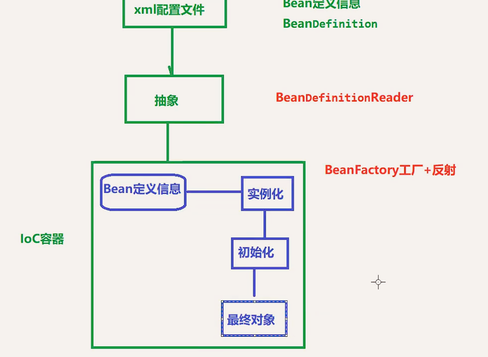

# Spring6
## 最低要求
jdk17
## 基础知识
### spring framework
* 特点
  * 非侵入式：试用sf框架开发时，对程序本身结构影响非常小。对领域模块可以做到零污染
  * 控制反转
  * 面向切面编程
  * 容器：spring ioc是一个容器，包含管理组件对象的生命周期，屏蔽了组件创建过程的大量细节，降低门槛，提高开发效率
  * 组件化：简单组件配置成一个复杂应用，可以使用xml和java注解组合这些对象
  * 一站式：ioc和aop可以整合各种框架和第三方库
* 组成
  * Spring Aop
    * `spring-aop`：面向切面编程的应用模块，整合`ASM`，`CGLib`，`JDK Proxy`
    * `spring-aspects`：集合`AspectJ`，`aop`应用框架
    * `spring-instrument`：动态`Class Loading`模块
  * Spring Data Access
    * `spring-jdbc`：`spring`对`jdbc`的封装，用以简化`jdbc`操作
    * `spring-orm`：`java对象`与`数据库`的映射框架
    * `spring-oxm`：`java对象`与`xml文件`的映射框架
    * `spring-jms`：`Spring`对`Java Message Service`（Java消息服务）的封装，用于服务之间通信
    * `spring-tx`：spring jdbc`事务`管理
  * Spring Web
    * `spring-web`：最基础的web支持，建立于`spring-context`之上，通过`servlet`和`listener`来初始化ioc容器
    * `spring-webmvc`：实现web mvc
    * `spring-webscoket`：与前端的全双工通信协议
    * `spring-webflux`：spring5.0支持，取代传统的java servlet，`非阻塞式`Reactive Web框架，异步，非阻塞，事件驱动的服务
  * Spring Message
    * `spring-messaging`：spring4.0提供，为spring集成一些基础的报文传送服务
  * Spring Test
    * `spring-text`：集成测试支持，主要对junit的封装

### 核心
#### Ioc
* `Inverse of Control` 控制反转
  * Spring通过IoC容器管理所有java对象的实例化和初始化，控制对象与对象之间的依赖关系
  * IoC管理的对象称为Spring Bean，它与直接new出来的java对象没有任何区别
* 把创建对象的过程交给Spring进行管理
* 如何创建对象？
  1. 加载bean.xml文件
  2. 对xml文件进行解析
  3. 获取xml文件bean标签属性值id和属性class值
  4. 使用反射根据全路径创建对象
  5. ![]
* 控制反转，反转的是什么？
  1. 创建对象的权力
  2. 对象与对象之间依赖关系的维护权
* 控制反转如何实现？
  * DI（Dependency Injection）:依赖注入
##### DI
* 定义：Spring创建对象的过程中，将对象属性通过配置进行注入
* 实现方式：
  * set注入
  * 构造注入
    * 根据name注入
    * 根据index注入，0为开始
* 特殊值处理
  * 字面量赋值：int a = 10;  10就是字面量  使用value给bean的属性赋值时，Spring会把value属性看作字面量
  * null：```
  <constructor-arg index="0">
    <null></null>
    </constructor-arg>```
  * xml实体：value中特殊符号转义，如`< `需要转义为`&lt`, `>` 需要转义为`&gt`,转义字符用`;`分割
  * CDATA节：解决特殊符号```<value><![CDATA[ a > b]]></value>```
* BeanFactory结构：
  * 
* 获取bean的三种方式
  * 根据bean.xml中的类id
  * 根据类的属性，类.class
    * `注意`：根据类型获取bean时，要求ioc中指定类型的bean只有一个
  * 根据id和属性
#### Aop
* `Aspect Oriented Programming` 面向切面编程
* 封装多个类的公共行为，将与业务无关的公共调用逻辑封装起来
* 优点
  * 减少重复代码
  * 降低模块间的耦合度
* 应用
  * 日志
  * 事务
  * 权限